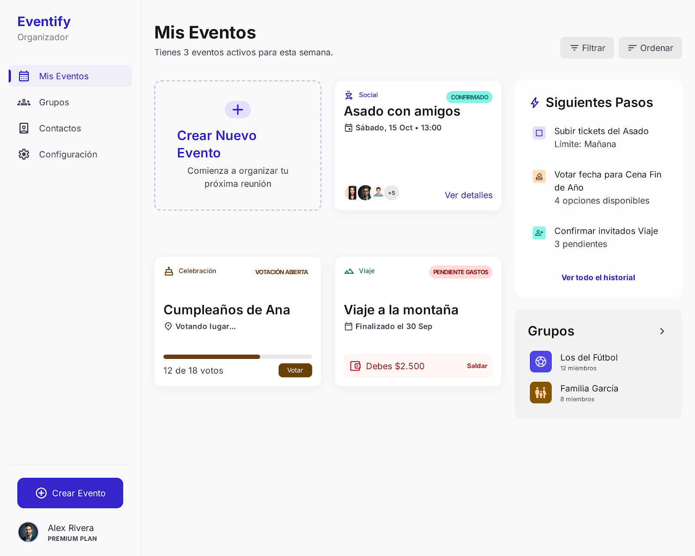
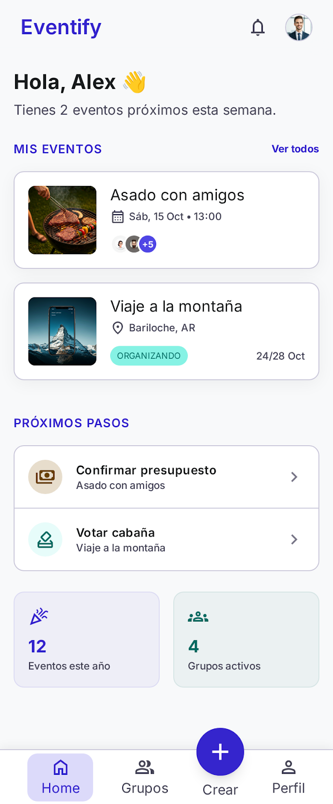
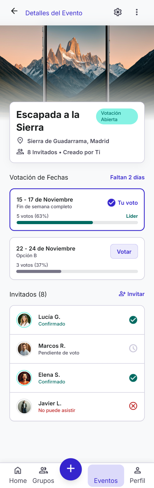
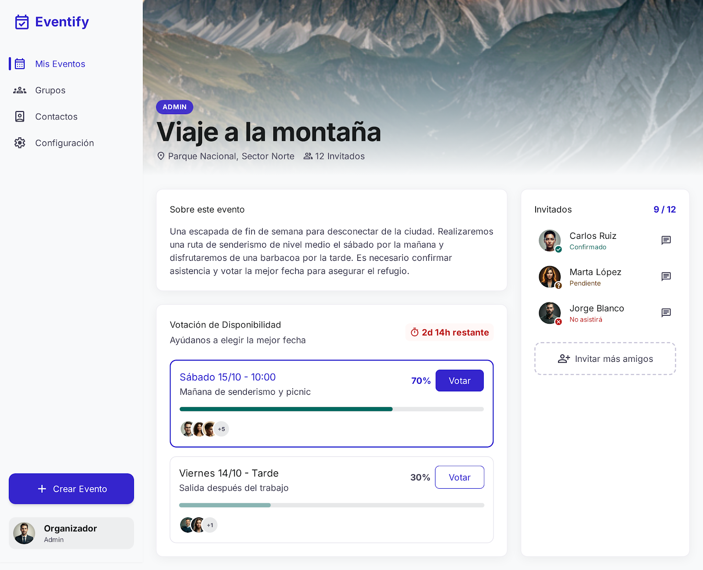
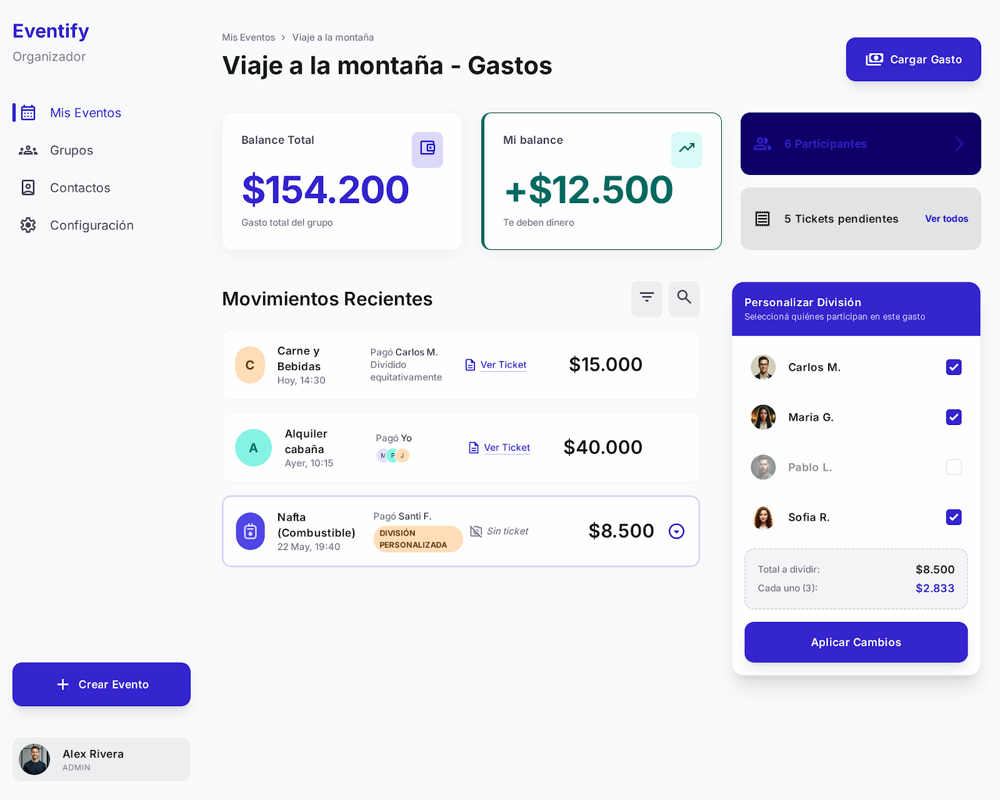
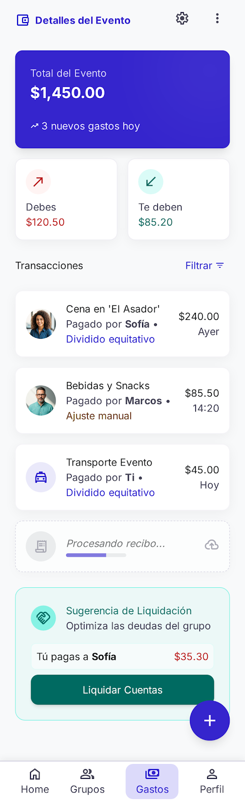
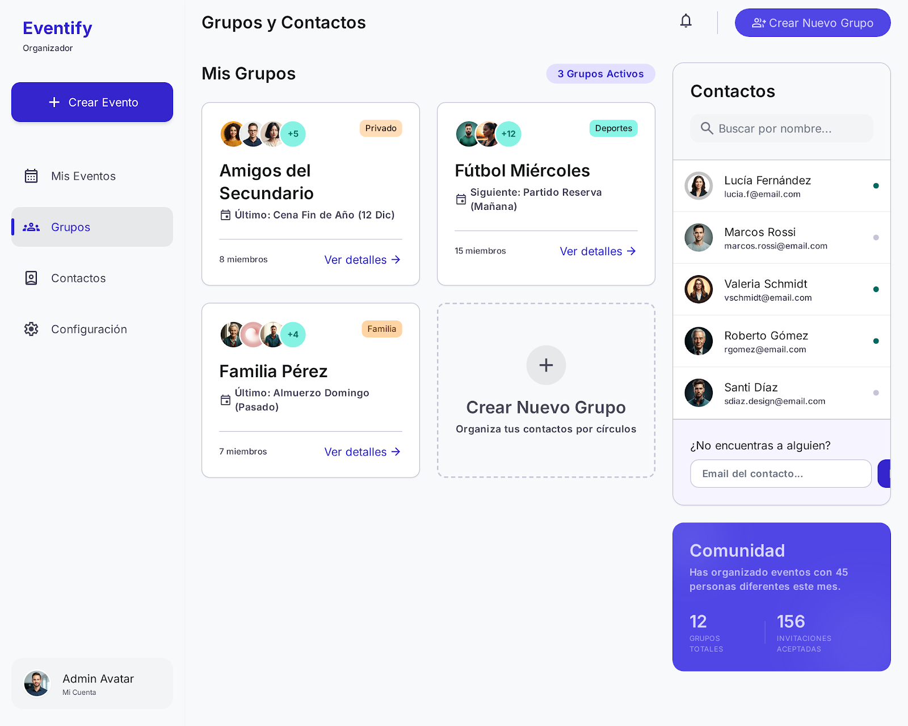
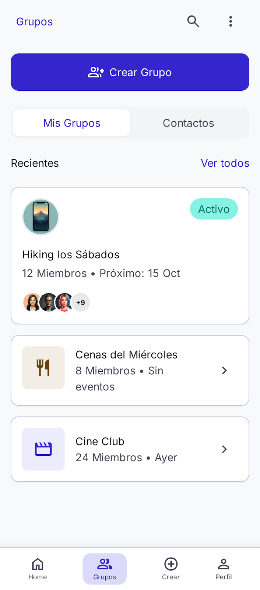

## Brand & Style

The design system is built to evoke a sense of organized joy and seamless collaboration. Targeting social organizers and event attendees, the aesthetic balances professional utility with a warm, approachable personality. 

The style is **Modern Corporate with a Soft Edge**, leaning heavily into high-quality whitespace and intentional "breathing room" to reduce cognitive load during complex planning tasks. It utilizes a refined mix of **Minimalism** for structure and **Soft Glassmorphism** for interactive overlays, ensuring the UI feels premium yet accessible. The emotional goal is to move the user from the stress of logistics to the excitement of the event itself.

## Colors

This design system utilizes a "Vibrant Soft" palette. The **Indigo Primary** (#4F46E5) serves as the main driver for action and brand recognition. The **Teal Secondary** (#0D9488) is reserved for success states, confirmed attendance, and "voted" indicators, providing a calming counterpoint to the primary blue. 

The **Amber Tertiary** (#F59E0B) is used sparingly for pending actions, alerts, or "not yet decided" statuses. The foundation of the UI sits on a crisp white (#FFFFFF) or very soft gray (#F9FAFB) background to maintain a high-end, clean look. Text follows a strict hierarchy of deep charcoal for readability and medium grays for meta-information.

## Typography

The typography system relies exclusively on **Inter** for its exceptional legibility and neutral, modern tone. 

- **Headlines:** Use tighter letter-spacing and bold weights to create a strong visual anchor for event titles and section headers.
- **Body:** Standardized at 16px for optimal readability across all devices.
- **Labels:** Used for navigation items, tags, and "voted" counts, often employing slightly heavier weights (600) at smaller sizes to ensure they don't get lost in the layout.

## Layout & Spacing

This design system follows an **8px grid system** for consistent vertical and horizontal rhythm. 

- **Desktop:** Features a fixed-width **Minimalist Sidebar** (260px) on the left. The main content area uses a fluid grid with a maximum container width of 1280px. Content is centered with generous 40px margins on ultra-wide screens.
- **Mobile:** Transition to a 4-column fluid layout with 16px side margins. Navigation shifts to a **Bottom Bar** for reachability, featuring a floating center action button for "Create."
- **Rhythm:** Use `lg` (24px) spacing between cards and `md` (16px) for internal card padding to maintain the "airy" feel.

## Elevation & Depth

Visual hierarchy is achieved through **Tonal Layering** and **Ambient Shadows**. 

The background is typically `#F9FAFB`. Interactive cards sit on a pure white background with a very soft, diffused shadow (`0px 4px 20px rgba(0, 0, 0, 0.05)`). This makes them appear to float slightly above the surface without feeling heavy. 

Hover states on cards or buttons should increase this shadow slightly to provide tactile feedback. Modals and popovers use a backdrop blur (Glassmorphism) of 12px to keep the user oriented within the event context while focusing on the specific task at hand.

## Shapes

The shape language is defined by **pronounced, friendly roundedness**. 

All standard containers and cards use a **16px (rounded-xl)** corner radius. Smaller elements like buttons and input fields use an **8px (rounded-md)** radius. Avatars should always be perfectly circular to contrast with the rectangular card shapes. This high level of roundedness reinforces the "Amigable" (friendly) aspect of the brand personality.

## Components

- **Buttons:** Primary buttons are Indigo with white text. Secondary buttons use a light Indigo tint background (#EEF2FF) with Indigo text. All have 8px rounded corners.
- **Cards (Events):** White background, 16px radius, subtle border (#F3F4F6). Headlines at the top, followed by a metadata row (date/location) using `label-sm`.
- **Voting Elements:** 
    - **Progress Bars:** Use a thick 8px height with a rounded track. The filled portion uses Teal (#0D9488).
    - **Selected State:** A 2px Indigo border surrounding the entire voting card or option.
- **Expense Lists:** Clean rows with 12px padding. Avatars (32px) on the left, name and description stacked, and amount in `label-md` on the far right.
- **Receipt Upload:** A dashed border container (#D1D5DB) with a centered icon and "Upload Receipt" label in `text-muted`.
- **Sidebar (Desktop):** Icons use a 24px bounding box. Active states feature a vertical 4px "pill" indicator on the left edge and an Indigo tint for the icon.
- **Bottom Bar (Mobile):** 64px height, pure white background with a top stroke border. Icons are spaced evenly, with the "Create" button optionally styled as a primary action circle in the center.

## CAPTURAS PARA LA APP

       